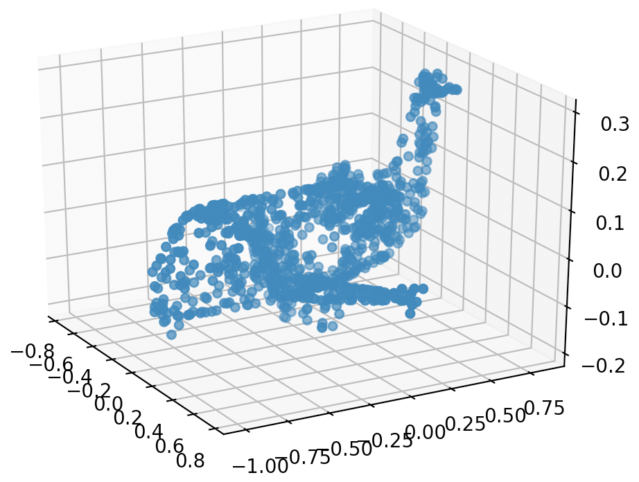
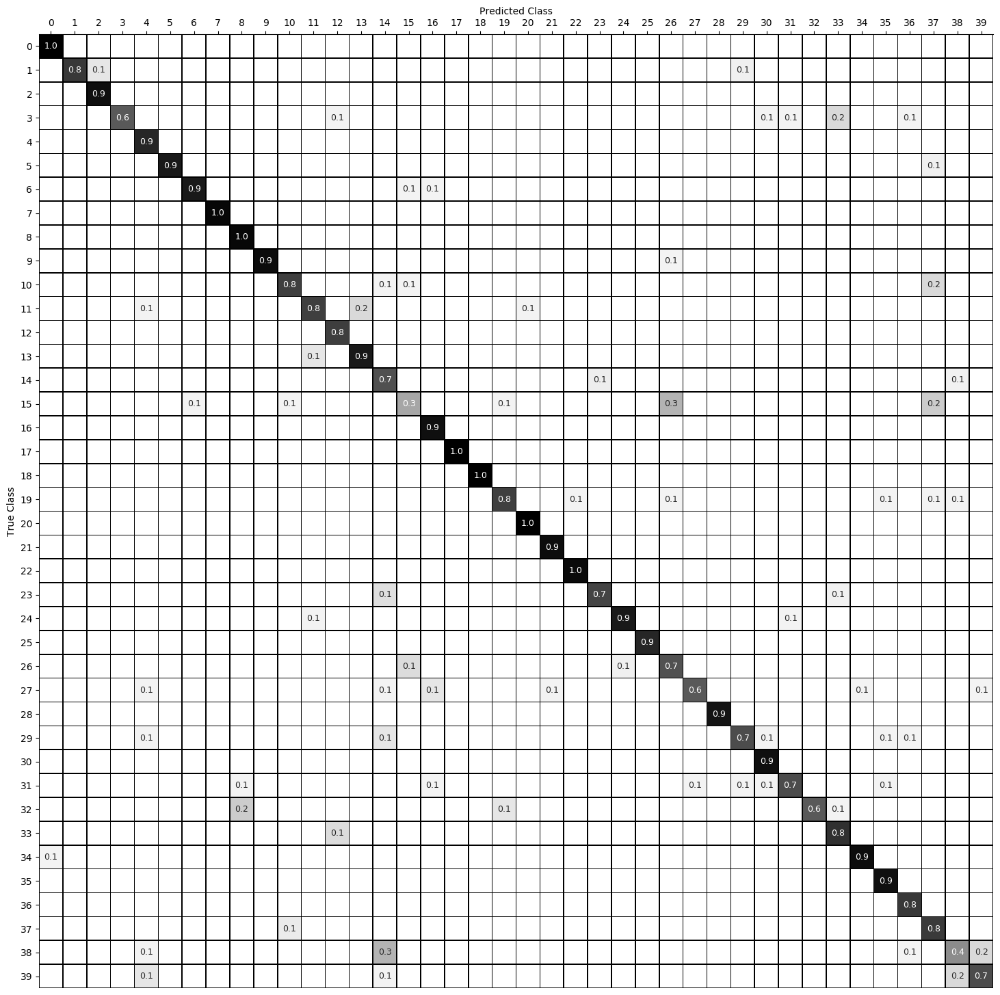

# Own implementation of PointNet

This project is a personal implementation of the point cloud object classification portion of PointNet [1] and is implemented in TensorFlow 2.0, including utilization of `tf.keras` layers and `tf.data.Dataset`. An accompanying white paper overview can be found [here](https://medium.com/@luis_gonzales/an-in-depth-look-at-pointnet-111d7efdaa1a).

## Setup
`pointnet.yml` contains the environment libraries used in this project. Running `./init.sh` downloads a processed version of ModelNet40 [2] to the project root directory. The downloaded directory contains point clouds normalized to the unit sphere and saved as `.npy` files.

If one prefers to do the conversion from the raw dataset to point clouds normalized to the unit sphere, there are various helper scripts in `utils/` that we're used to process the data.

## Dataset
Fig. 1 shows a histogram of the 40 classes comprising the training and test sets of ModelNet40. As can be seen, there's a decent level of class imbalance, which motivated the use of anchor loss [3] during training.

  

  
Fig. 1: Histogram of training and test sets.

Fig. 2 shows an airplane from the test normalized to the unit sphere.

  

  
Fig. 2: Airplane from test set normalized to the unit sphere.

## Model Architecture
The original PointNet architecture is shown below in Fig. 3. This project implements the classification portion, but adding the segmentation portion only requires concatenating two embedding tensors and adding two MLPs (implemented as conv2d for weight-sharing).

  

  
Fig. 3: PointNet model architecture.

The architecture is surprisingly simple and quite intuitive. The classification network uses a shared multi-layer perceptron (MLP) to map each of the n input points from three dimensions (x, y, z) to 64 dimensions. It’s important to note that a single multi-layer perceptron is shared for each of the n points (i.e., mapping is identical and independent on the n points). This procedure is repeated to map the n points from 64 dimensions to 1024 dimensions. Each mapping is aided by a T-Net for transformation invariance. With the points in a higher-dimensional embedding space, max pooling is used to create a global feature vector in ℝ¹⁰²⁴. Finally, a three-layer fully-connected network is used to map the global feature vector to k output classification scores.

## Training
With ModelNet40 located in the project root directory, training can be launched by running `python3 src/train.py`. Optional command-line arguments include batch size, number of epochs, initial learning rate, and whether to use [wandb](https://www.wandb.com/) to monitor training.

Training consisted of experimenting with constant vs exponential decay learning rate schedules, learning rate and batch norm momentum warm-up, and anchor loss [3]. Interestingly, anchor loss did not improve performance, suggesting that objects in the dataset are generally dissimilar from one another. Data augmentation consists of rotating point cloud samples along the vertical axis and adding Gaussian noise to each point comprising the point cloud.

Experiments can be found [here](https://app.wandb.ai/lrg/pointnet_own). The final validation metrics are indicative of underfitting, suggesting that it may be worthwhile to increase the model complexity.

## Inference
To perform inference, run `python3 src/inference.py <file>`, where `<file>` refers to a numpy `.npy` file containing a normalized point cloud. The project directory contains a point cloud of an airplane from the test set to test inference. Optional command-line arguments for `src/inference.py` include pointing to a different checkpoint and visualizing the point cloud contained in `<file>`.

## Results
Below are metrics for the test set. For reference, the test set consists of 2,468 point cloud samples.

| Metric      | Score   |
| :---------: |:-------:|
| Accuracy    | 0.858   |
| Precision   | 0.858   |
| Recall      | 0.858   |
| F negatives | 351     |
| F positives | 351     |
| T negatives | 95,901  |
| T positives | 2,117   |

The confusion matrix for the test set is below in Fig. 4. The most notable mistakes are confusing a bench for a table, a flower pot for a plant and a vase, and a wardrobe for a dresser and an Xbox. 

  

  
Fig. 4: Confusion matrix for test set.

## References
[1] [PointNet: Deep Learning on Point Sets for 3D Classification and Segmentation, C. Qi et al., 2016](https://arxiv.org/abs/1612.00593)

[2] [ModelNet40 dataset](https://modelnet.cs.princeton.edu)

[3] [Anchor Loss: Modulating Loss Scale based on Prediction Difficulty, S. You et al., 2019](https://arxiv.org/abs/1909.11155)
