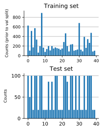
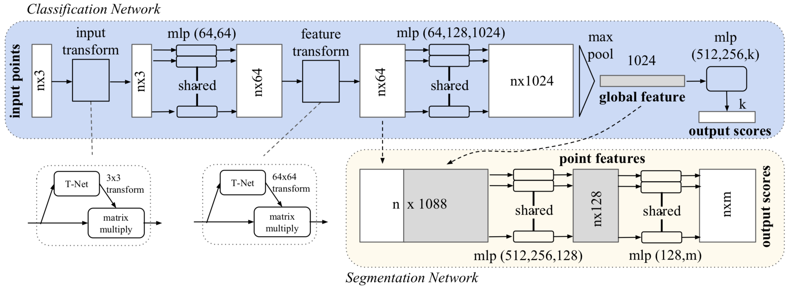

# Own implementation of PointNet
Under development! Expecting completion around 12/2019.

This project is a personal implementation of the object classification portion of PointNet [1] and is implemented in TensorFlow 2.0, including utilization of `tf.keras` layers and `tf.data.Dataset`. An accompanying white paper overview can be found [here](https://medium.com/@luis_gonzales/an-in-depth-look-at-pointnet-111d7efdaa1a).

## Setup
Used PCL. If you don't have it and are using a Mac, I recommend installing via Homebrew. Final model downloaded at ...

## Dataset

  

  
Fig. 1: Given two input frames, the images represented  by (c) and (d) are passed as inputs to the CNN.

## Model Architecture
The original PointNet architecture is shown below in Fig. 2. This project implements the classification portion, but adding the segmentation portion only requires concatenating two embedding tensors and two MLPs (implemented as conv2d for weight-sharing).

  

  
Fig. 2: PointNet model architecture.

The architecture is surprisingly simple and quite intuitive. The classification network uses a shared multi-layer perceptron (MLP) to map each of the n input points from three dimensions (x, y, z) to 64 dimensions. It’s important to note that a single multi-layer perceptron is shared for each of the n points (i.e., mapping is identical and independent on the n points). This procedure is repeated to map the n points from 64 dimensions to 1024 dimensions. Each mapping is aided by a T-Net for transformation invariance. With the points in a higher-dimensional embedding space, max pooling is used to create a global feature vector in ℝ¹⁰²⁴. Finally, a three-layer fully-connected network is used to map the global feature vector to k output classification scores.

## Training
With ModelNet40 located in the project root directory, training can be launched by running `python3 src/train.py`. Optional command-line arguments include batch size, number of epochs, initial learning rate, and whether to use wandb to monitor training.

Training consisted of experimenting with constant vs exponential decay learning rate, learning rate and batch norm momentum warm-up, and anchor loss [3]. Interestingly, anchor loss did not improve performance, indicating that the objects in the dataset are quite different from one another. Data augmentation consists of rotating the point cloud along the vertical axis and adding Gaussian noise to each point. The final validation metrics are indicative of underfitting, suggesting that it may be worthwhile increasing the model complexity.

## Inference
As mentioned in the setup section, the final model can be downloaded at ... With the model checkpoints in the `model/` directory, one can perform inference by running `python3 src/inference.py <file>`, where `<file>` refers to a numpy `.npy` file containing a normalized point cloud. Optional command-line arguments include pointing to a different checkpoint and visualizing the point cloud contained in `<file>`.

## Results
Below are metrics of the final model given the test set. For reference, the test set consists of 2,468 point clouds.

| Metric      | Score   |
| :---------: |:-------:|
| Accuracy    | 0.858   |
| Precision   | 0.858   |
| Recall      | 0.858   |
| F negatives | 351     |
| F positives | 351     |
| T negatives | 95,901  |
| T positives | 2,117   |

| Metric      | Score   |
| :---------: |:-------:|
| Accuracy    | 0.858   |
| Precision   | 0.858   |
| Recall      | 0.858   |
| F negatives | 351     |
| F positives | 351     |
| T negatives | 95,901  |
| T positives | 2,117   |

| Metric      | Score   |
| :---------: |:-------:|
| Accuracy    | 0.858   |
| Precision   | 0.858   |
| Recall      | 0.858   |
| F negatives | 351     |
| F positives | 351     |
| T negatives | 95,901  |
| T positives | 2,117   |

Confusion matrix. 

## References
[1] [PointNet: Deep Learning on Point Sets for 3D Classification and Segmentation, C. Qi et al., 2016](https://arxiv.org/abs/1612.00593)

[2] [ModelNet40 dataset](https://modelnet.cs.princeton.edu)

[3] [Anchor Loss: Modulating Loss Scale based on Prediction Difficulty, S. You et al., 2019](https://arxiv.org/abs/1909.11155)
